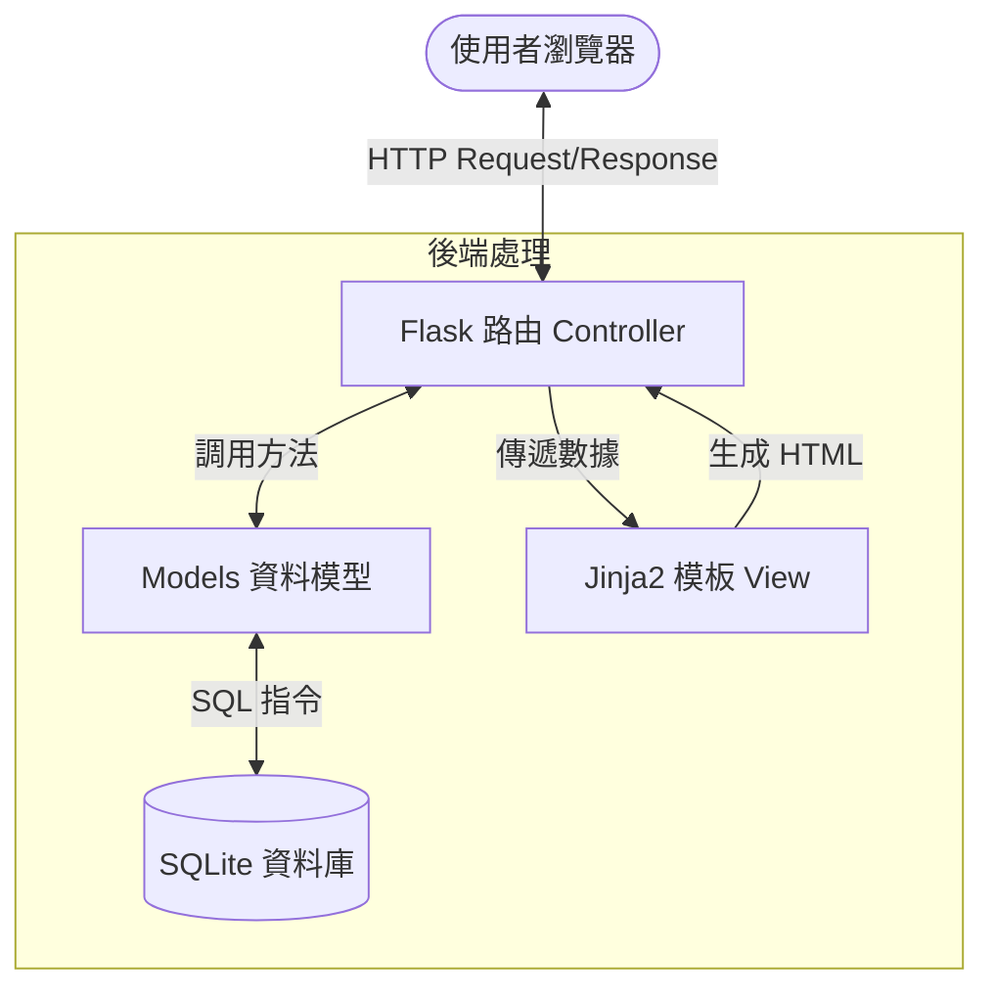

# 系統架構設計文件 (ARCHITECTURE.md) - 自動打工排班系統

## 1. 技術架構說明

### 1.1 選用技術與原因
- **後端語言**：**Python**。具有豐富的數據處理庫，適合開發自動排班的演算法（如邏輯回歸、基因演算法或簡單的權重排序）。
- **後端框架**：**Flask**。輕量級框架，適合中小型商家管理系統，擴展性強且易於上手。
- **模板引擎**：**Jinja2**。Flask 內建模板引擎，負責動態生成 HTML 頁面，不需額外的前端框架（如 React/Vue），減少開發複雜度。
- **資料庫**：**SQLite**。檔案型資料庫，無需額外安裝伺服器，適合單店或小型連鎖店的數據量，且易於備份與遷移。

### 1.2 Flask MVC 模式說明
本系統採用類 MVC (Model-View-Controller) 架構：
- **Model (資料模型)**：負責定義資料結構（員工、班表、請假紀錄）以及與 SQLite 的溝通邏輯。
- **View (視圖)**：由 Jinja2 模板組成，負責呈現使用者介面。
- **Controller (控制器/路由)**：負責處理 HTTP 請求，調用模型獲取數據，並決定渲染哪個 View 傳回給瀏覽器。

---

## 2. 專案資料夾結構

```text
Final-Report/
├── app/
│   ├── models/          # 資料庫模型與資料處理邏輯 (Model)
│   │   ├── employee.py  # 員工資料處理
│   │   ├── schedule.py  # 排班演算邏輯
│   │   └── leave.py     # 請假流程管理
│   ├── routes/          # Flask 路由處理 (Controller)
│   │   ├── main.py      # 首頁與通用路由
│   │   ├── auth.py      # 登入與權限驗證
│   │   └── scheduler.py # 自動排班功能路由
│   ├── templates/       # Jinja2 HTML 模板 (View)
│   │   ├── base.html    # 基礎版型
│   │   ├── index.html   # 儀表板/首頁
│   │   └── schedule.html# 排班顯示頁面
│   └── static/          # CSS / JS / 圖片等靜態資源
│       ├── css/         # 樣式表
│       └── js/          # 前端交互邏輯
├── instance/            # 存放執行時生成的私有檔案
│   └── database.db      # SQLite 資料庫主檔案
├── docs/                # 專案文件 (PRD, Architecture)
│   ├── PRD.md
│   └── ARCHITECTURE.md
├── app.py               # Flask 應用入口程式
└── requirements.txt     # 套件清單 (Flask, SQLAlchemy 等)
```

---

## 3. 元件關係圖



---

## 4. 關鍵設計決策

1.  **採用傳統 SSR (伺服器端渲染)**：為了確保商家能快速部署且不需處理複雜的前端建置流程，選擇 Flask 直接渲染 HTML，能有效利用 Python 的處理能力並減少前後端溝通的延遲感。
2.  **演算法職責分離**：將「自動排班演算」獨立於路由邏輯之外（放在 `app/models/schedule.py`），以便後續針對不同業種調整排班權重而不影響系統架構。
3.  **SQLite 管理簡化**：之所以不選擇 MySQL/PostgreSQL，是因為排班系統的初期目標是中小型商家，SQLite 的零配置特性（Zero-config）能極大降低維護門檻。
4.  **權限中間件 (Middleware)**：設計統一的 `auth.py` 路由模組，確保所有排班與刪除操作都必須經過身分驗證，並在後端留下操作紀錄。

---
*本文件旨在提供開發團隊明確的技術方向，後續將根據此架構進行 API 設計與資料庫實作。*
