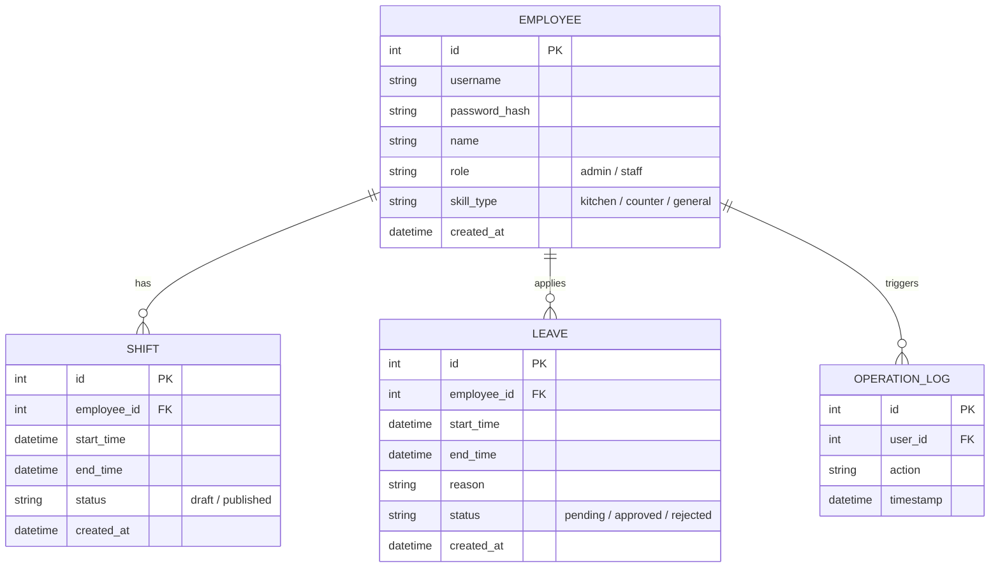

# 資料庫設計文件 (DB_DESIGN.md) - 自動打工排班系統

本文件詳述了系統的資料庫結構，採用 SQLite 作為儲存引擎。

---

## 1. 實體關係圖 (ER Diagram)

---

## 2. 資料表說明

### 2.1 employees (員工表)
儲存使用者帳號與權限資訊。
- `id`: 主鍵，自動遞增。
- `role`: 分為 `admin` (店長) 與 `staff` (員工)。
- `skill_type`: 用於自動排班時分配適當職位。

### 2.2 shifts (班表)
儲存排班時段資料。
- `employee_id`: 關聯至員工。
- `status`: `draft` 代表店長編輯中，`published` 代表已發布，員工可見。

### 2.3 leaves (請假紀錄)
儲存員工請假申請與審核狀態。
- 系統自動排班時會檢查此表，避開已核准的請假時段。

### 2.4 operation_logs (操作紀錄)
紀錄關鍵操作（如發布班表、修改權限），用於安全性稽核。

---

## 3. 關鍵設計決策
1.  **狀態欄位 (Status Fields)**：所有主要實體（Shift, Leave）皆包含狀態欄位，以支援審核流程與草稿功能。
2.  **時間戳記**：每張表均包含 `created_at`，便於追蹤資料建立時間。
3.  **弱關聯設計**：雖然 SQLite 支援外鍵，但在 Model 層級也會加強驗證，確保資料一致性。
