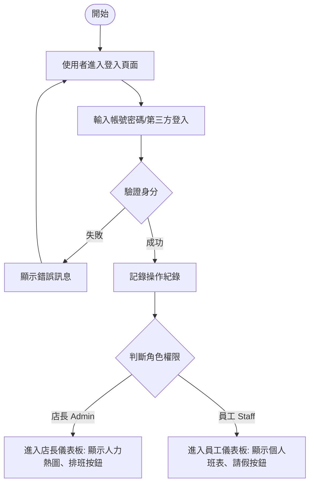
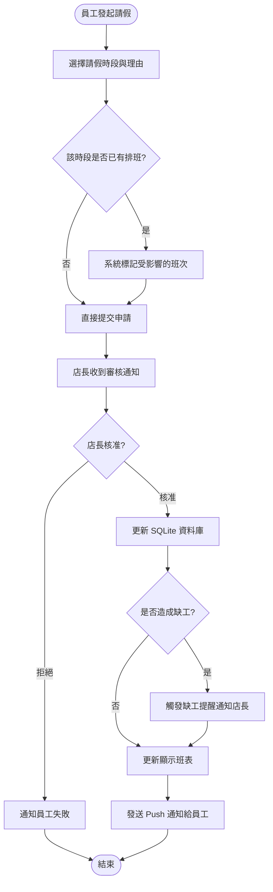
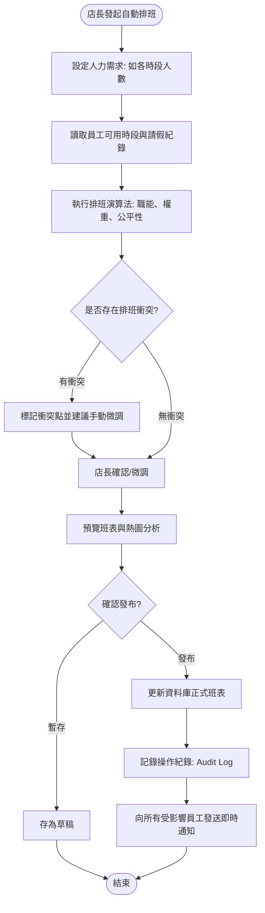

# 系統流程圖文件 (FLOWCHART.md) - 自動打工排班系統

本文件詳述了自動打工排班系統中的核心操作流程，涵蓋身分驗證、請假管理及自動排班的核心邏輯。

---

## 1. 使用者身分驗證與登入流程
確保只有經過授權的使用者才能存取系統，並根據權限（店長/員工）進行導向。

---

## 2. 員工請假與班表動態調整流程
描述員工提交請假申請後，系統如何與現有班表整合並通知管理者。

---

## 3. 管理者自動排班與通知流程
描述系統如何運用智慧演算生成班表，並處理衝突檢查與發布通知。

---

## 4. 關鍵流程說明
1.  **衝突檢查 (Conflict Check)**：排班演算法在運算過程中，會同步檢查員工的請假狀態與已排定的班次，確保不會發生「一人分飾兩角」或在請假時段排班的情況。
2.  **即時通知 (Real-time Notification)**：為了滿足 PRD 中「1 秒內通知」的需求，當管理者點擊「發布」後，系統會透過非同步任務或推播服務即時發送通知。
3.  **視覺化回饋**：所有的排班異動都會即時同步至前端的熱圖與行事曆視圖。
